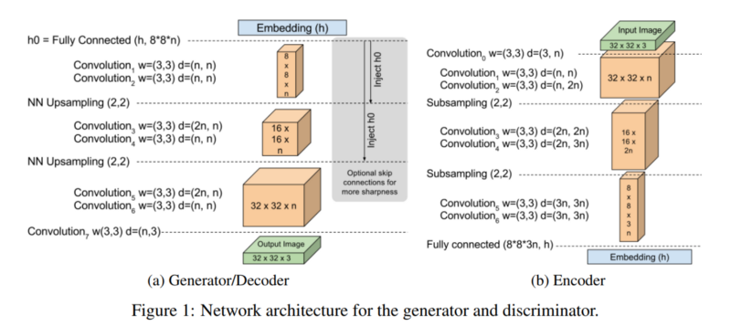
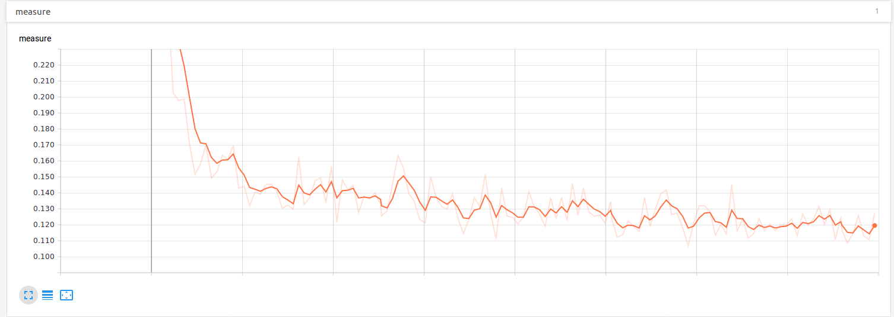

# began-tensorflow
Tensorflow implementation of [BEGAN: Boundary Equilibrium Generative Adversarial Networks](https://arxiv.org/abs/1703.10717). Please refer to the [article](https://github.com/zsdonghao/text-to-image) which presents the details about algorithm and code.

## Prerequisites
- Python 2.7
- tensorflow 1.12
- matplotlib

## Usage
First,download align_celeba dataset from https://www.kaggle.com/jessicali9530/celeba-dataset
And then extract and move to "../data/img_align_celeba"

Second, run train.py

    $ python train.py

Each 300 steps,save sample results in samples folder.
Each an epoch, save checkpoint(ckpt) in model folder  

Tensorflow provides a good visualization tool called tensorboard. 
We measured the value of convergence per 300 steps.

    $ tensorboard --logdir ./logs

Third, run test.py

    $ python test.py

Restore model with latest_checkpoint. 

While on training, checkpoint(ckpt) is generated in model folder.

Or you can download pretrained model from below link.
https://drive.google.com/open?id=1qOF3drMy0EGvWAahwJpweOyCzuoZy5Va

Generate sample results based on uniform random vector. 

## Results

